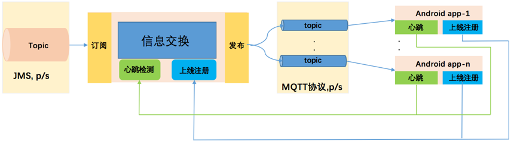

## 总览

该工程解决ActiveMQ与Android通讯消息持久化问题，
工程主要包含有服务端适配器和android端的sdk两个模块。

## 结构图


## 例子
* `服务端消息发布`
服务端在发布消息到指定的jms主题上，该主题的名称为: S_PUB_+"serverId"。
<br>
代码：

```

        String host = "192.168.1.87";
        int mqtt_port = 1883;
        int jms_port = 61616;
        JmsMqttConfigure configure = new JmsMqttConfigure();
         //服务端发布消息主题名称
        configure.setServerId("server-1111");
        configure.setHost(host);
        configure.setMqtt_port(mqtt_port);
        configure.setJms_port(jms_port);

        JmsMqttBuilder jmsMqttCreator = new JmsMqttBuilder(configure);
        jmsMqttCreator.start();
        
```      
        
* `android端mqtt消息订阅`
android端订阅到的消息是经过适配器将jms主题中的消息消费掉然后发送到mqtt协议的主题上，android客户端消费的是这个MQTT主题中的数据，持久化也是在jms消息的发布订阅的持久化。
<br>
代码：

```

        //服务端发布消息主题名称
        String serverId = "server-1111";

        //客户端订阅(mqtt)主题名称
        String androidId = "android-1111";

        String host = "192.168.100.111";
        int port = 1883;

        MqBuilder mqBuilder = new MqBuilder(host, port, serverId, androidId);
        
        //设置消息消费监听器
        mqBuilder.setMonitor((message) -> System.out.println(message));
        //启动
        mqBuilder.start();
        
```

* `安卓demo`
[参看](https://github.com/Cooze/JmsMQTT-Android)
